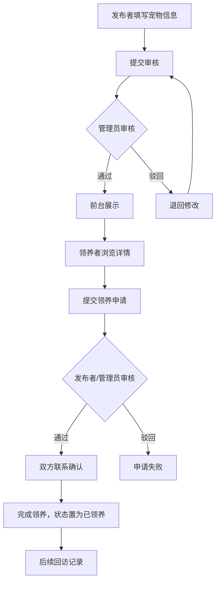

# 宠物领养信息发布与管理平台 PRD

## 1. 产品概述

本项目构建一个基于 Web 的宠物领养信息发布与管理平台，解决现有领养渠道信息分散、流程不规范、管理效率低等问题。平台面向潜在领养者、救助机构与系统管理员，提供宠物信息集中发布、多条件检索、领养全流程线上管理与后台审核统计能力，传播"领养代替购买"理念，提升救助机构的信息化水平与领养成功率。

- 目标用户：潜在领养者（个人）、救助机构、平台管理员、未注册游客
- 产品价值：整合领养信息资源、规范领养流程、保障宠物福利、降低信息搜寻与管理成本

## 2. 核心功能

### 2.1 用户角色

| 角色 | 注册方式 | 核心权限 |
|------|----------|----------|
| 游客 | 无需注册 | 浏览宠物信息、查看公告、注册成为注册用户 |
| 注册用户 | 邮箱/手机号注册 | 浏览检索、发布与维护宠物信息、提交领养申请、收藏关注、留言咨询、维护个人资料 |
| 救助机构 | 注册时申请机构身份 | 批量发布与管理救助宠物信息、处理领养申请 |
| 系统管理员 | 后台指定 | 审核宠物信息与领养申请、用户管理、公告管理、数据统计 |

### 2.2 功能模块

**前台（公开访问与注册用户）**
1. **首页**：Hero 引导区、最新领养信息、热门宠物、平台公告、领养流程引导
2. **宠物列表页**：分类浏览、多条件筛选（种类/年龄/性别/地区）、关键词搜索、排序
3. **宠物详情页**：图片轮播、宠物档案、健康与免疫信息、领养申请入口、留言互动、收藏
4. **登录注册页**：登录、注册、找回密码
5. **个人中心**：我的发布、我的领养申请、我的收藏、个人资料
6. **发布宠物页**：填写宠物信息表单、上传照片、提交审核
7. **公告中心**：平台公告列表、领养须知
8. **关于我们**：平台介绍、领养流程说明、合作伙伴

**后台（管理员）**
9. **后台首页**：数据概览、待审核提醒
10. **宠物信息审核**：审核列表、通过/驳回、上下架
11. **领养管理**：申请审核、状态跟踪、回访记录
12. **用户管理**：用户查询、禁用启用、角色设置
13. **公告管理**：发布、编辑、删除公告
14. **数据统计**：发布量、申请量、领养成功率等统计图表

### 2.3 页面详情

| 页面名称 | 模块名称 | 功能说明 |
|---------|----------|----------|
| 首页 | Hero 引导区 | 平台 Slogan、领养理念、立即领养按钮、背景大图 |
| 首页 | 最新领养信息 | 卡片网格展示 8-12 张最新可领养宠物 |
| 首页 | 公告条/公告卡 | 平台公告横向滚动展示 |
| 首页 | 领养流程引导 | 4 步领养流程图示（浏览→申请→审核→领养） |
| 宠物列表页 | 筛选侧栏 | 种类、品种、年龄、性别、地区、状态筛选 |
| 宠物列表页 | 宠物卡片网格 | 图片、姓名、品种、年龄、状态徽章、收藏按钮 |
| 宠物列表页 | 排序与分页 | 最新/热门排序、分页或无限滚动 |
| 宠物详情页 | 图片轮播 | 多张宠物照片轮播或缩略图切换 |
| 宠物详情页 | 宠物档案 | 基本信息、性格特点、健康与免疫情况 |
| 宠物详情页 | 领养申请 | 申请按钮（已登录可点）、申请表单弹层 |
| 宠物详情页 | 留言互动 | 留言列表、发表留言、回复 |
| 宠物详情页 | 相关推荐 | 同品种或同机构的其他宠物 |
| 登录注册页 | 登录/注册卡片 | 切换标签、表单、社交登录占位 |
| 个人中心 | 个人资料卡 | 头像、昵称、联系方式、角色徽章 |
| 个人中心 | Tab 切换 | 我的发布/我的申请/我的收藏 |
| 发布宠物页 | 多步表单 | 基本信息→健康信息→照片上传→预览提交 |
| 公告中心 | 公告列表 | 标题、摘要、发布时间、阅读全文 |
| 后台首页 | 数据卡片 | 总宠物数、待审核、申请数、领养成功率 |
| 后台首页 | 待办列表 | 待审核宠物、待审核申请快捷处理 |
| 宠物信息审核 | 审核表格 | 列表、详情预览、通过/驳回按钮、上下架 |
| 领养管理 | 申请表格 | 申请人信息、宠物信息、审核状态、状态更新 |
| 用户管理 | 用户表格 | 搜索、角色筛选、禁用/启用、角色设置 |
| 公告管理 | 公告表格 | 新建、编辑、删除、发布/下线 |
| 数据统计 | 统计图表 | 折线/柱状/饼图展示发布量、申请量、种类分布 |

## 3. 核心流程

**信息发布流程**：发布者填写宠物信息表单（种类、年龄、性别、健康、免疫、照片等）→ 提交平台审核 → 管理员审核通过后前台展示，未通过则退回修改或驳回 → 发布者可编辑/下架。

**领养申请流程**：领养者浏览宠物详情 → 在线提交领养申请（含申请说明）→ 发布者或管理员审核 → 审核通过后双方联系确认 → 完成领养并更新宠物状态为"已领养" → 可添加回访记录。

**后台管理流程**：管理员登录后台 → 处理待审核宠物信息与领养申请 → 维护用户与公告 → 通过数据统计掌握平台运行情况。

## 4. 用户界面设计

### 4.1 设计风格

- **整体风格**：温暖编辑式杂志风，以宠物摄影为视觉主体，营造可信赖、有温度的领养氛围。拒绝冷冰冰的科技感，强调"陪伴感"与"家"的意象。
- **主色调**：暖米白 `#FBF7F0` 作为底色，深珊瑚橙 `#E8623A` 作为强调色（用于按钮/链接/徽章），深炭灰 `#2B2A28` 作为正文与标题，柔薄荷 `#9DBBA3` 作为辅助色（用于"已领养"等正向状态徽章）。
- **次级色**：暖灰 `#E8E2D6` 用于卡片背景与分隔，琥珀金 `#C99A3F` 用于公告与提示。
- **按钮风格**：圆角胶囊型（`rounded-full`），主按钮实心深珊瑚橙带细微投影，次级按钮描边款，hover 时有轻微位移与色彩加深。
- **字体**：标题使用 `Fraunces`（编辑式衬线，带光学尺寸，温暖有性格），正文使用 `Plus Jakarta Sans`（现代圆润无衬线，可读性高），数字与标签使用 `JetBrains Mono`（小尺寸场景的精致感）。
- **布局**：杂志式不对称布局，宠物卡片网格采用错落高度，关键页面大量留白，列表页采用左侧筛选 + 右侧网格。
- **图标**：使用 `lucide-react` 线性图标，与文字搭配使用，不堆砌。
- **动效**：首页 Hero 区图片淡入缩放，卡片 hover 时上浮 + 阴影加深 + 图片轻微放大，滚动触发的元素淡入上移（`stagger`）。

### 4.2 页面设计概览

| 页面名称 | 模块名称 | UI 元素 |
|---------|----------|--------|
| 首页 | Hero 引导区 | 全宽大图背景，左侧大号衬线标题 + Slogan + 主按钮，右侧悬浮宠物照片卡 |
| 首页 | 最新领养信息 | 3 列错落卡片网格，每张卡片图片在上、信息在下、收藏图标右上 |
| 首页 | 领养流程引导 | 4 步水平时间线，圆形数字 + 文字 + 连接虚线 |
| 首页 | 公告条 | 横向滚动卡片，琥珀金边框，左侧"公告"标签 |
| 宠物列表页 | 筛选侧栏 | 左侧固定窄栏，分组折叠筛选项，顶部关键词搜索框 |
| 宠物列表页 | 卡片网格 | 右侧 3 列网格，卡片圆角图片 + 信息层 + 状态徽章 |
| 宠物详情页 | 图片轮播 | 顶部大图 + 缩略图列，左右切换箭头 |
| 宠物详情页 | 档案面板 | 左 2/3 信息卡片 + 右 1/3 黏性"申请领养"卡片 |
| 宠物详情页 | 留言区 | 评论列表 + 底部输入框，头像 + 昵称 + 时间 |
| 登录注册页 | 居中卡片 | 左侧品牌插画区 + 右侧表单卡片，Tab 切换登录/注册 |
| 个人中心 | 资料卡 | 顶部带封面的资料卡 + 下方 Tab 内容区 |
| 发布宠物页 | 多步表单 | 顶部步骤指示器，单步表单 + 下一步/上一步 |
| 公告中心 | 公告列表 | 左侧列表 + 右侧详情，或全列表点击展开 |
| 后台首页 | 数据卡片 | 顶部 4 张数据统计卡 + 待办表格 |
| 后台管理页 | 数据表格 | 顶部筛选栏 + 主表格 + 行内操作按钮 |

### 4.3 响应式

- 桌面优先，断点 `md: 768px` / `lg: 1024px`。
- 移动端：导航折叠为汉堡菜单，卡片网格由 3 列 → 2 列 → 1 列，详情页黏性申请卡变为底部固定按钮，筛选侧栏变为顶部抽屉。
- 触控优化：按钮最小 44px 点击区，卡片整体可点击，关闭手势支持。

### 4.4 3D 场景

本项目不涉及 3D 场景。

## 5. 非功能需求

| 类别 | 要求 |
|------|------|
| 性能 | 常规页面首屏渲染 < 2s，列表分页加载，图片懒加载 |
| 安全 | 密码 bcrypt 加密存储，JWT 鉴权，输入校验，防 SQL 注入与 XSS |
| 可用性 | 友好提示与引导，操作可撤销提示，错误状态清晰 |
| 可维护性 | 模块化组件，TypeScript 类型完整，关键逻辑单元测试 |
| 兼容性 | Chrome / Edge / Safari / Firefox 最新版，响应式适配 |
