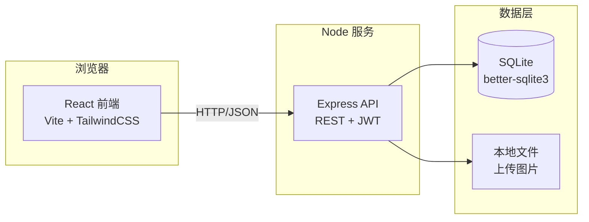
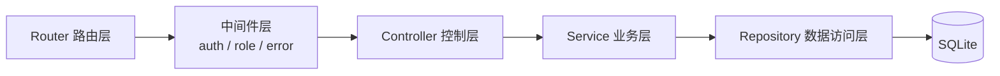
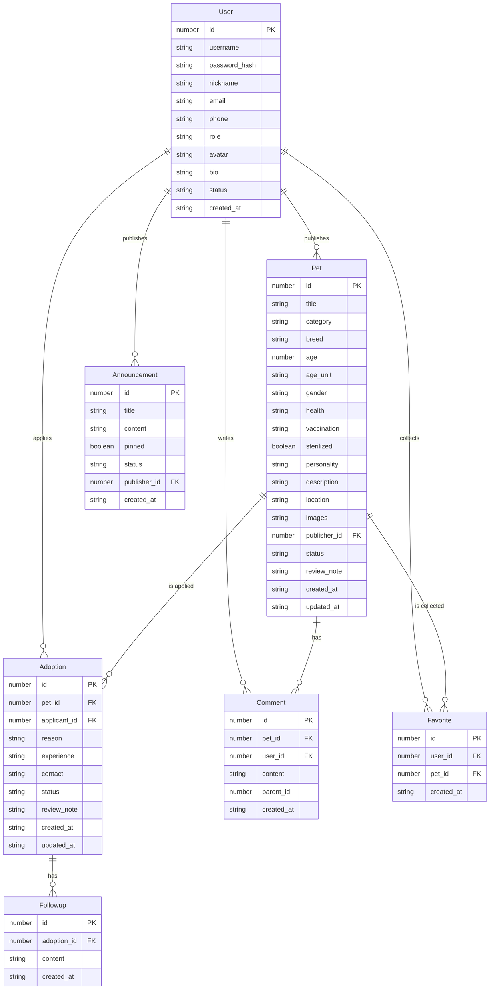

# 宠物领养信息发布与管理平台 技术架构

## 1. 架构设计



平台采用 B/S 架构，前端为单页应用（SPA），后端为 Express REST API，数据持久化使用 SQLite（无需外部数据库服务，便于本地与演示），上传图片存于本地 `uploads/` 目录并通过 Express 静态托管。

## 2. 技术说明

- 前端：React 18 + TypeScript + Vite + TailwindCSS 3 + React Router 6 + Zustand（状态管理）+ lucide-react（图标）
- 初始化工具：vite-init（模板 `react-express-ts`）
- 后端：Express 4 + TypeScript + better-sqlite3 + bcrypt + jsonwebtoken + multer（文件上传）
- 数据库：SQLite（通过 better-sqlite3 同步驱动，适合中小型应用）
- 图表：recharts（后台数据统计）

## 3. 路由定义

### 3.1 前端路由

| 路由 | 用途 |
|------|------|
| `/` | 首页 |
| `/pets` | 宠物列表（支持查询参数筛选） |
| `/pets/:id` | 宠物详情 |
| `/login` | 登录注册页 |
| `/publish` | 发布宠物信息（需登录） |
| `/profile` | 个人中心（需登录） |
| `/announcements` | 公告中心 |
| `/about` | 关于我们 |
| `/admin` | 后台首页（管理员） |
| `/admin/pets` | 宠物信息审核 |
| `/admin/adoptions` | 领养管理 |
| `/admin/users` | 用户管理 |
| `/admin/announcements` | 公告管理 |
| `/admin/stats` | 数据统计 |

### 3.2 后端 API 路由

| 方法 | 路径 | 用途 |
|------|------|------|
| POST | `/api/auth/register` | 注册 |
| POST | `/api/auth/login` | 登录 |
| GET | `/api/auth/me` | 获取当前用户 |
| GET | `/api/pets` | 宠物列表（支持查询参数筛选） |
| GET | `/api/pets/:id` | 宠物详情 |
| POST | `/api/pets` | 发布宠物（需登录） |
| PUT | `/api/pets/:id` | 编辑宠物 |
| DELETE | `/api/pets/:id` | 删除宠物 |
| POST | `/api/pets/:id/favorite` | 收藏 |
| DELETE | `/api/pets/:id/favorite` | 取消收藏 |
| GET | `/api/pets/:id/comments` | 留言列表 |
| POST | `/api/pets/:id/comments` | 发表留言 |
| POST | `/api/adoptions` | 提交领养申请 |
| GET | `/api/adoptions` | 申请列表（按用户/发布者过滤） |
| PUT | `/api/adoptions/:id` | 更新申请状态 |
| GET | `/api/announcements` | 公告列表 |
| POST | `/api/announcements` | 发布公告（管理员） |
| PUT | `/api/announcements/:id` | 编辑公告 |
| DELETE | `/api/announcements/:id` | 删除公告 |
| GET | `/api/admin/pets` | 待审核宠物列表 |
| PUT | `/api/admin/pets/:id/review` | 审核宠物（通过/驳回） |
| PUT | `/api/admin/pets/:id/status` | 上下架 |
| GET | `/api/admin/users` | 用户列表 |
| PUT | `/api/admin/users/:id` | 用户启用/禁用/角色 |
| GET | `/api/admin/stats` | 平台统计数据 |
| POST | `/api/upload` | 图片上传 |

## 4. API 定义

### 4.1 通用响应

```ts
type ApiResponse<T> = {
  code: number;        // 0 表示成功，非 0 表示业务错误
  message: string;
  data: T;
};
```

### 4.2 主要类型

```ts
type UserRole = 'user' | 'org' | 'admin';

interface User {
  id: number;
  username: string;
  nickname: string;
  email: string;
  phone?: string;
  role: UserRole;
  avatar?: string;
  bio?: string;
  status: 'active' | 'disabled';
  createdAt: string;
}

interface Pet {
  id: number;
  title: string;
  category: 'dog' | 'cat' | 'other';
  breed: string;
  age: number;
  ageUnit: 'month' | 'year';
  gender: 'male' | 'female' | 'unknown';
  health: string;
  vaccination: string;
  sterilized: boolean;
  personality: string;
  description: string;
  location: string;
  images: string[];
  publisherId: number;
  status: 'pending' | 'available' | 'adopted' | 'rejected' | 'offline';
  reviewNote?: string;
  createdAt: string;
  updatedAt: string;
}

interface Adoption {
  id: number;
  petId: number;
  applicantId: number;
  reason: string;
  experience: string;
  contact: string;
  status: 'pending' | 'approved' | 'rejected' | 'completed' | 'cancelled';
  reviewNote?: string;
  followups: Followup[];
  createdAt: string;
  updatedAt: string;
}

interface Followup {
  id: number;
  adoptionId: number;
  content: string;
  createdAt: string;
}

interface Announcement {
  id: number;
  title: string;
  content: string;
  pinned: boolean;
  status: 'published' | 'offline';
  publisherId: number;
  createdAt: string;
}

interface Comment {
  id: number;
  petId: number;
  userId: number;
  content: string;
  parentId?: number;
  createdAt: string;
}

interface Favorite {
  id: number;
  userId: number;
  petId: number;
  createdAt: string;
}
```

## 5. 服务端架构



- **Router**：按资源划分（`auth/pets/adoptions/announcements/admin/upload`）
- **Middleware**：`authMiddleware`（解析 JWT）、`roleMiddleware`（角色校验）、`errorMiddleware`（统一错误处理）
- **Controller**：接收请求、参数校验、调用 Service、返回响应
- **Service**：业务逻辑（如审核流程、申请状态流转）
- **Repository**：封装 better-sqlite3 SQL 操作

## 6. 数据模型

### 6.1 ER 图



### 6.2 DDL（SQLite）

```sql
CREATE TABLE IF NOT EXISTS users (
  id INTEGER PRIMARY KEY AUTOINCREMENT,
  username TEXT NOT NULL UNIQUE,
  password_hash TEXT NOT NULL,
  nickname TEXT NOT NULL,
  email TEXT NOT NULL UNIQUE,
  phone TEXT,
  role TEXT NOT NULL DEFAULT 'user',
  avatar TEXT,
  bio TEXT,
  status TEXT NOT NULL DEFAULT 'active',
  created_at TEXT NOT NULL DEFAULT (datetime('now'))
);

CREATE TABLE IF NOT EXISTS pets (
  id INTEGER PRIMARY KEY AUTOINCREMENT,
  title TEXT NOT NULL,
  category TEXT NOT NULL,
  breed TEXT,
  age INTEGER,
  age_unit TEXT DEFAULT 'year',
  gender TEXT,
  health TEXT,
  vaccination TEXT,
  sterilized INTEGER DEFAULT 0,
  personality TEXT,
  description TEXT,
  location TEXT,
  images TEXT,
  publisher_id INTEGER NOT NULL,
  status TEXT NOT NULL DEFAULT 'pending',
  review_note TEXT,
  created_at TEXT NOT NULL DEFAULT (datetime('now')),
  updated_at TEXT NOT NULL DEFAULT (datetime('now')),
  FOREIGN KEY (publisher_id) REFERENCES users(id)
);
CREATE INDEX IF NOT EXISTS idx_pets_status ON pets(status);
CREATE INDEX IF NOT EXISTS idx_pets_category ON pets(category);

CREATE TABLE IF NOT EXISTS adoptions (
  id INTEGER PRIMARY KEY AUTOINCREMENT,
  pet_id INTEGER NOT NULL,
  applicant_id INTEGER NOT NULL,
  reason TEXT,
  experience TEXT,
  contact TEXT,
  status TEXT NOT NULL DEFAULT 'pending',
  review_note TEXT,
  created_at TEXT NOT NULL DEFAULT (datetime('now')),
  updated_at TEXT NOT NULL DEFAULT (datetime('now')),
  FOREIGN KEY (pet_id) REFERENCES pets(id),
  FOREIGN KEY (applicant_id) REFERENCES users(id)
);
CREATE INDEX IF NOT EXISTS idx_adoptions_pet ON adoptions(pet_id);
CREATE INDEX IF NOT EXISTS idx_adoptions_applicant ON adoptions(applicant_id);

CREATE TABLE IF NOT EXISTS followups (
  id INTEGER PRIMARY KEY AUTOINCREMENT,
  adoption_id INTEGER NOT NULL,
  content TEXT,
  created_at TEXT NOT NULL DEFAULT (datetime('now')),
  FOREIGN KEY (adoption_id) REFERENCES adoptions(id)
);

CREATE TABLE IF NOT EXISTS announcements (
  id INTEGER PRIMARY KEY AUTOINCREMENT,
  title TEXT NOT NULL,
  content TEXT NOT NULL,
  pinned INTEGER DEFAULT 0,
  status TEXT NOT NULL DEFAULT 'published',
  publisher_id INTEGER NOT NULL,
  created_at TEXT NOT NULL DEFAULT (datetime('now')),
  FOREIGN KEY (publisher_id) REFERENCES users(id)
);

CREATE TABLE IF NOT EXISTS comments (
  id INTEGER PRIMARY KEY AUTOINCREMENT,
  pet_id INTEGER NOT NULL,
  user_id INTEGER NOT NULL,
  content TEXT NOT NULL,
  parent_id INTEGER,
  created_at TEXT NOT NULL DEFAULT (datetime('now')),
  FOREIGN KEY (pet_id) REFERENCES pets(id),
  FOREIGN KEY (user_id) REFERENCES users(id)
);
CREATE INDEX IF NOT EXISTS idx_comments_pet ON comments(pet_id);

CREATE TABLE IF NOT EXISTS favorites (
  id INTEGER PRIMARY KEY AUTOINCREMENT,
  user_id INTEGER NOT NULL,
  pet_id INTEGER NOT NULL,
  created_at TEXT NOT NULL DEFAULT (datetime('now')),
  UNIQUE(user_id, pet_id),
  FOREIGN KEY (user_id) REFERENCES users(id),
  FOREIGN KEY (pet_id) REFERENCES pets(id)
);
```

### 6.3 初始数据

- 默认管理员：用户名 `admin` / 密码 `admin123`（bcrypt 加密）
- 示例救助机构用户：`org1` / `org123`
- 示例领养用户：`user1` / `user123`
- 6-8 条示例宠物信息（含图片占位）、2-3 条示例公告、若干留言与申请数据

## 7. 安全与中间件

- 密码使用 `bcrypt` 加密存储（salt rounds = 10）
- JWT 通过 `Authorization: Bearer <token>` 传递，7 天有效期
- 角色 RBAC：`user` / `org` / `admin`，敏感操作前由 `roleMiddleware` 校验
- 输入校验：在 Controller 层对必填、长度、枚举值校验
- 静态文件：`/uploads` 路径托管上传图片，限制图片大小与 MIME 类型
- CORS：开发环境允许 `localhost`，生产按需配置

## 8. 项目结构

```
traeweb/
├── api/                    # 后端代码
│   ├── src/
│   │   ├── routes/         # 路由
│   │   ├── controllers/    # 控制器
│   │   ├── services/       # 业务层
│   │   ├── repositories/  # 数据访问
│   │   ├── middlewares/    # 鉴权/错误中间件
│   │   ├── utils/          # 工具函数
│   │   ├── db/             # 数据库初始化与种子
│   │   └── index.ts        # 入口
│   ├── uploads/            # 上传图片目录
│   └── tsconfig.json
├── src/                    # 前端代码
│   ├── components/         # 通用组件
│   ├── pages/              # 页面
│   ├── layouts/            # 布局
│   ├── hooks/              # 自定义 hooks
│   ├── store/              # zustand 状态
│   ├── utils/              # 工具函数与 API 封装
│   ├── types/              # 类型定义
│   └── App.tsx
├── shared/                 # 前后端共享类型
├── package.json
└── vite.config.ts
```
